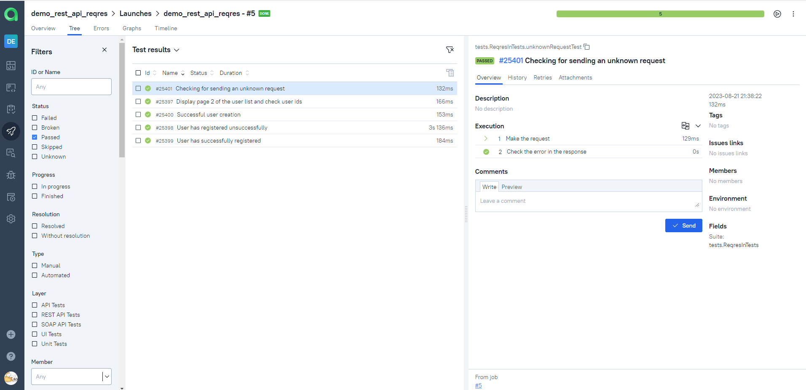

# <a name="The project to automate testing of REST Services">The project to automate testing of REST Services Help Project at [Reqres.in](https://reqres.in/)</a>
<p  align="center">
<a href="https://reqres.in/"></a> 
</p>


# <a name="Contents">Contents</a>
+ [Description](#Description)
+ [Technologies and Tools](#technologies-and-tools)
+ [Launch Options](#launch-options)
  + [Commands for gradle](#commands-for-gradle)
  + [Run in Jenkins](#run-in-jenkins)
+ [Telegram notifications](#telegram-notifications)
+ [Test results in Allure Report](#test-results-in-allure-report)
+ [Integration with Allure TestOps](#integration-with-allure-testops)


# <a name="Description">Description</a>
  The project consists of API tests for the site https://reqres.in/.
  Brief list of facts about the project:
- [x] Used Models and Specifications (Specs)
- [x] Used by REST Assured to test GET, POST, DELETE services
- [x] Allure rest-assured listener with custom templates
- [x] Integration with `Allure TestOps`
- [x] Autotests as test documentation

[Back to Contents ⬆](#Contents)

# <a name="Technologies and Tools">Technologies and Tools</a>

| Java                                                                                                      | IntelliJ Idea                                                                                                                 | GitHub                                                                                                     | JUnit 5                                                                                                           | Gradle                                                                                                     | Selenide                                                                                                         | REST Assured                                                                                                      |                                                                                                                  Jenkins |
|:----------------------------------------------------------------------------------------------------------|-------------------------------------------------------------------------------------------------------------------------------|------------------------------------------------------------------------------------------------------------|-------------------------------------------------------------------------------------------------------------------|------------------------------------------------------------------------------------------------------------|------------------------------------------------------------------------------------------------------------------|-------------------------------------------------------------------------------------------------------------------|-------------------------------------------------------------------------------------------------------------------------:|
| <a href="https://www.java.com/"></a>  | <a id ="tech" href="https://www.jetbrains.com/idea/"></a> | <a href="https://github.com/"></a> | <a href="https://junit.org/junit5/"></a> | <a href="https://gradle.org/"></a> | <a href="https://selenide.org/"></a> | <a href="https://rest-assured.io/"></a> |         <a href="https://www.jenkins.io/"></a> |


| Jira                                                                                                                          | Allure                                                                                                                     | Allure TestOps                                                                                                          |
|:------------------------------------------------------------------------------------------------------------------------------|----------------------------------------------------------------------------------------------------------------------------|-------------------------------------------------------------------------------------------------------------------------|
| <a href="https://www.atlassian.com/ru/software/jira"></a> | <a href="https://github.com/allure-framework"></a> | <a href="https://qameta.io/"></a>    |


`Java` - Autotest programming language \
`Selenide` - a framework on which autotests are written \
`Gradle` - automatic build tool \
`JUnit5` - testing framework \
`Jenkins` - CI/CD to run tests \
`Selenoid` - for launching a browser remotely in `Docker` containers \
`REST Assured` - for testing REST-API services\
`Allure Report` - for building graphical reports \
`Allure TestOps` - as a test management system

[Back to Contents ⬆](#Contents)

# <a name="Launch Options">Launch Options</a>

## <a name="Commands for gradle">Commands for gradle</a>

To run locally and in Jenkins, use the following command:
```bash
gradle clean test
```

## <a name="Run in Jenkins">Run in [Jenkins](https://jenkins.autotests.cloud/job/demo_rest_api_reqres/)</a>
> The link is available only to authorized users.

Main page of the project:
<p  align="center">

</p>


_The project build result is available in:_
>- <code><strong>*Allure Report*</strong></code>
>- <code><strong>*Allure TestOps*</strong></code>

[Back to Contents ⬆](#Contents)

# <a>Telegram notifications</a>
The Telegram bot sends a short report to the specified telegram chat based on the results of each build.
<p  align="center">

</p>

If you want to use this project to send a report to your telegram chat, you will need to create a configuration file.

File example `config.json`
<p  align="center">

</p>

[Back to Contents ⬆](#Contents)

# <a name="Test results in Allure Report">Test results in [Allure Report](https://jenkins.autotests.cloud/job/demo_rest_api_reqres/allure/)</a>
> The link is available only to authorized users.

## Home


<p align="center">
  
</p>

##  Tests

<p align="center">
  
</p>


##  Graphs

<p align="center">
  
</p>


[Back to Contents ⬆](#Contents)

# <a>Integration with [Allure TestOps](https://allure.autotests.cloud/launch/29001)</a>
> The link is available only to authorized users.

## Allure TestOps Dashboard

<p align="center">
  
</p>

## Allure TestOps Test Cases

<p align="center">
  
</p>

[Back to Contents ⬆](#Contents)
