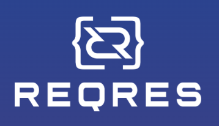

<h2 align="center"> REST Services Help Project at reqres.in </h2>
<p  align="center">


</p>


# <a name="Contents">Contents</a>
+ [Description](#Description)
+ [Technologies and Tools](#Technologies-and-Tools)
+ [Launch Options](#Launch-Options)
  + [Commands for gradle](#Commands-for-gradle)
  + [Run in Jenkins](#Run-in-jenkins)
+ [Test results in Allure Report](#Test-results-in-Allure-Report)
+ [Integration with Allure TestOps](#Integration-with-Allure-TestOps)


# <a name="Description">Description</a>
  The project consists of API tests for the site https://reqres.in/.
  Brief list of facts about the project:
- [x] Used Models and Specifications (Specs)
- [x] Used by REST Assured to test GET, POST, DELETE services
- [x] Allure rest-assured listener with custom templates
- [x] Integration with `Allure TestOps`
- [x] Autotests as test documentation


# <a name="Technologies and Tools">Technologies and Tools</a>
<p  align="center">
  <code></code>
  <code></code>
  <code></code>
  <code></code>
  <code></code>
  <code></code>
  <code></code>
  <code></code>
  <code></code>
  <code></code>
  <code></code>
</p>

`Java` - Autotest programming language \
`Selenide` - a framework on which autotests are written \
`Gradle` - automatic build tool \
`JUnit5` - testing framework \
`Jenkins` - CI/CD to run tests \
`Selenoid` - for launching a browser remotely in `Docker` containers \
`REST Assured` - for testing REST-API services\
`Allure Report` - for building graphical reports \
`Allure TestOps` - as a test management system

[Back to Contents ⬆](#Contents)

# <a name="Launch Options">Launch Options</a>

## <a name="Commands for gradle">Commands for gradle</a>

To run locally and in Jenkins, use the following command:
```bash
gradle clean test
```


## <a name="Run in Jenkins">Run in [Jenkins](https://jenkins.autotests.cloud/job/RestApiProjectQaGuRu_Litinskiy/)</a>


Main page of the project:
<p  align="center">

</p>


_The project build result is available in:_
>- <code><strong>*Allure Report*</strong></code>
>- <code><strong>*Allure TestOps*</strong></code>


[Back to Contents ⬆](#Contents)

# <a name="Test results in Allure Report">Test results in [Allure Report](https://jenkins.autotests.cloud/job/RestApiProjectQaGuRu_Litinskiy/allure/)</a>

## Главное окно


<p align="center">
  
</p>

##  Tests

<p align="center">
  
</p>


##  Graphs

<p align="center">
  
</p>


[Back to Contents ⬆](#Contents)

# <a>Integration with [Allure TestOps](https://allure.autotests.cloud/launch/26543)</a>


## Allure TestOps Dashboard

<p align="center">
  
</p>

## Allure TestOps Test Cases

<p align="center">
  
</p>

[Back to Contents ⬆](#Contents)
